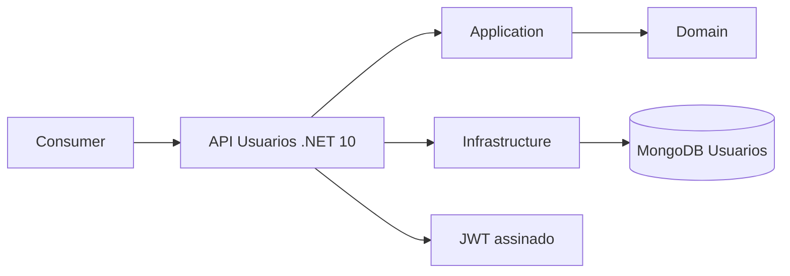

# Arquitetura

```mermaid
flowchart LR
    Consumer --> Api[API Usuarios .NET 10]
    Api --> App[Application]
    App --> Domain[Domain]
    Api --> Infra[Infrastructure]
    Infra --> Db[(MongoDB Usuarios)]
    Api --> Jwt[JWT assinado]
```

O segredo JWT é uma configuração externa compartilhada com a API de Vendas apenas para validação criptográfica; as bases permanecem independentes.
