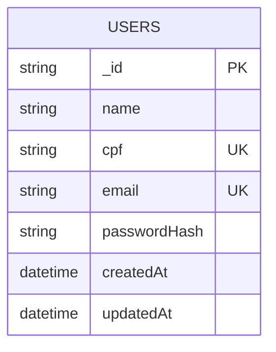

# Modelo MongoDB — Usuarios

```mermaid
erDiagram
    USERS {
      string _id PK
      string name
      string cpf UK
      string email UK
      string passwordHash
      datetime createdAt
      datetime updatedAt
    }
```

Índices únicos: `cpf` e `email`. O `passwordHash` usa BCrypt; senha original não é persistida.
